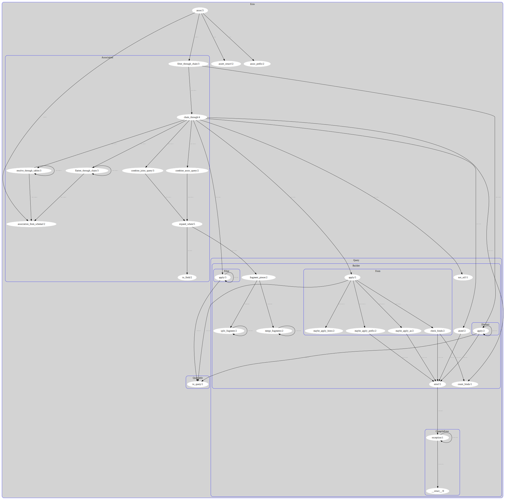

# Viz

Visualize the call graph for your Elixir codebase.



(Click on the image and then click "Raw" in the top-right to view the full interactive version)

## Usage

```
$ mix viz
```

This will create an out.csv file containing a call-graph of your application for analysis or importing into another tool.  It has two columns—`source` and `target`—and each row in the CSV represents a call from the `source` function to the `target` function.

You may specify a different filename with the `--filename` flag, e.g.

```
$ mix viz --filename myapp.csv
```

You can also export the call-graph for only a "slice" of your program.  For instance, if you only want data on calls made in the course of the computation of `MyApp.foo/2`, you would write:

```
$ mix viz --source MyApp.foo/2
```

Multiple sources are supported and are "or"ed together.  That is, if you want data on calls made in the course of the computation of `MyApp.foo/2` and `MyApp.bar/1`, you would write:

```
$ mix viz --source MyApp.foo/2 --source MyApp.bar/1
```

Additionally, specifying "sinks" is also supported.  Specifying a sink is a way to determine what functions depend on another;  e.g. if you want data on functions that reference `MyApp.foo/2` and functions that references those functions, you would write:

```
$ mix viz --sink MyApp.foo/2
```

Multiple sinks are supported and can be combined with sources to find paths from one (or more) function to another (or several).

Export formats other than the CSV format are available.  They are:
- `dot_hier` :: Function nodes are grouped into module nodes.  Module nodes are grouped by hierarchy (e.g. The `MyApp.Foo` node will be inside the `MyApp` node).
- `dot` :: Function nodes are grouped into module nodes.  Module nodes are not grouped.
- `dot_functions` :: Function nodes are not grouped; module nodes do not exist.
- `dot_modules` :: Only connections between module nodes are shown.  Function nodes do not exist.
- `json`

Alternative formats are specified with the `--format` flag, e.g.

```
$ mix viz --format dot
```

The first four use the [GraphViz DOT language](https://graphviz.org/doc/info/lang.html) to illustrate your call-graph.  Once you have created a `.dot` file, you can use a GraphViz tool (e.g. `dot`) to visualize the call-graph:

```
$ dot out.dot -Tsvg -o out.svg
```

This command creates an `out.svg` file which you can view in your browser.

The `dot` tool tries to create a heirarchy of nodes.  If this view is unhelpful to you, try `fdp` which uses force-directed placement to lay out nodes in a cluster.

This tool currently has two "analyzers" to find function calls; "tracer" and "beams".  The former uses an [Elixir compilation tracer] to aggregate call events from the Elixir compiler while the application is being compiled, the latter analyzes the `.beam` files produced when your application is compiled (a la Dialyzer).  Each has strengths and weaknesses.  The beams analyzer is not aware of macros whereas the tracer analyzer is.  On the other hand, the tracer analyzer can't see when a function call is injected into a function *by* a macro, whereas the beams analyzer can.  Thus, the default behavior is to use *both* analyzers, but if you have a specific need (e.g. speed), you can specify only one or the other.

To only use the "beams" analyzer (which much faster if your app is already compiled), invoke `mix viz` like so:
```
$ mix viz --analyzer beams
```

To only use the "tracer" analyzer, invoke `mix viz` like so:
```
$ mix viz --analyzer tracer
```


## Installation

The recommended approach is to install this application as an Elixir Archive:

```
$ mix archive.install github J3RN/viz
```

Alternatively, you can add Viz as a dependency of your application:

```elixir
def deps do
  [
    {:viz, git: "git@github.com:J3RN/viz.git", only: [:dev, :test], runtime: false}
  ]
end
```

[Elixir compilation tracer]: https://hexdocs.pm/elixir/Code.html#module-compilation-tracers
